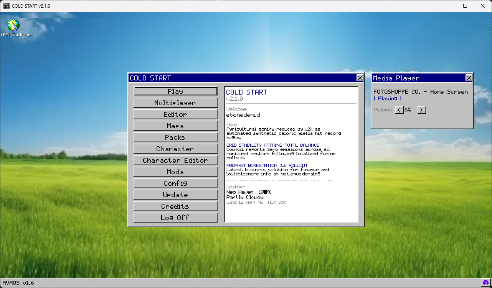
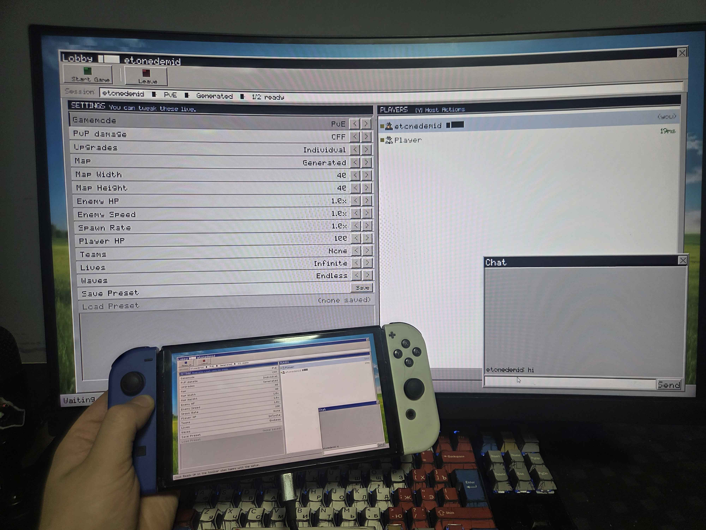
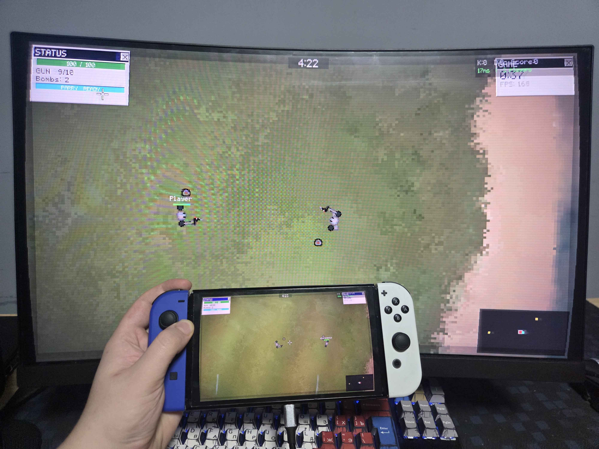

# COLD START  `v3.4.0`

roguelike survival with bombs, upgrades, parrying and a console where you can spawn a car and run enemies over. 
Runs on PC, Nintendo Switch homebrew, and Android.

License: GNU GPL - except music; consult authors before distributing. Sounds from https://pixabay.com/

Join our discord!
https://discord.gg/dv28MgtaNn

## Roadmap
~~1. Better enemy pathfinding and sound alert~~
~~2. Cutscenes and more triggers (maybe basic scripting) in editor~~

3. Official content pack (Story mode) <- We're here

4. Steam release (may be earlier, depends on the Ko-Fi goal)

## Workshop
https://etonedemid.github.io/coldstart-workshop/

## Screenshots







## Highlights

- PC, Switch, and Android builds from the same codebase
- Arena, co-op, deathmatch, team deathmatch, playlist, and custom-map play modes
- Host-authoritative online multiplayer (ENet) with full mod sync
- In-game map editor, character creator, and built-in texture editor
- Mod system: maps, packs, characters, sprites, sounds, gamemodes, items (soon)
- Resizable window with automatic letterboxing; 4:3 mode on square/portrait displays

## Build

### PC (Linux)

```bash
cmake -S . -B build-pc -DPLATFORM_PC=1
cmake --build build-pc -j4
./build-pc/cold_start
```

### Windows (MinGW cross-compile)

```bash
cmake -S . -B build-win -DCMAKE_TOOLCHAIN_FILE=toolchain-windows.cmake
cmake --build build-win -j4
```

Binary: `build-win/cold_start.exe`

### Nintendo Switch

```bash
make -j4
```

Binary: `cold_start.nro`

## Run

### Dedicated server

```bash
./cold_start --dedicated --port 7777 --max-players 16 --name my-server
```

Flags: `--password`, `--name`, `--max-players`

DigitalOcean setup:

```bash
chmod +x deploy/digitalocean/install_server.sh
./deploy/digitalocean/install_server.sh
sudo cp deploy/digitalocean/cold_start.service /etc/systemd/system/
sudo systemctl enable --now cold_start
sudo ufw allow 7777/udp
```

One-liner update for your VPS:

```bash
curl -fsSL https://raw.githubusercontent.com/etonedemid/cold-start-nx/main/deploy/digitalocean/update_server.sh | bash
```

### Switch via nxlink

```bash
nxlink -a <SWITCH_IP> -s cold_start.nro
```

## Controls

| Action | Keyboard/Mouse | Gamepad |
|--------|---------------|---------|
| Move | WASD | Left stick |
| Aim | Mouse | Right stick |
| Shoot | LMB | RT |
| Parry | Space | LB |
| Bomb | Q | LT |
| Melee | E | RB |
| Pause | Esc | Start |

## Modding

Mods live in `mods/` and are discovered at startup.

```
mods/mymod/
    mod.cfg
    characters/   (.cschar)
    maps/         (.csm)
    packs/        (.cspack)
    sprites/
    sounds/
    gamemodes/
    items/
```

**`mod.cfg` example**

```ini
[mod]
id=mymod
name=My Mod
version=1.0

[content]
characters=true
maps=true
sprites=true
sounds=true

[overrides]
player_speed=600
enemy_hp=5
```

Multiplayer mod sync ships all enabled mod content to clients before the match starts (cap: 64 MB). Character bundles sync separately (cap: 10 MB per player). Synced files land in `mods/_mp_sync/` and are rebuilt each session.

## Notes

- Config: `config.txt`
- Mod state: `modconfig.cfg`
- Dev console: `~` key (host or singleplayer)
